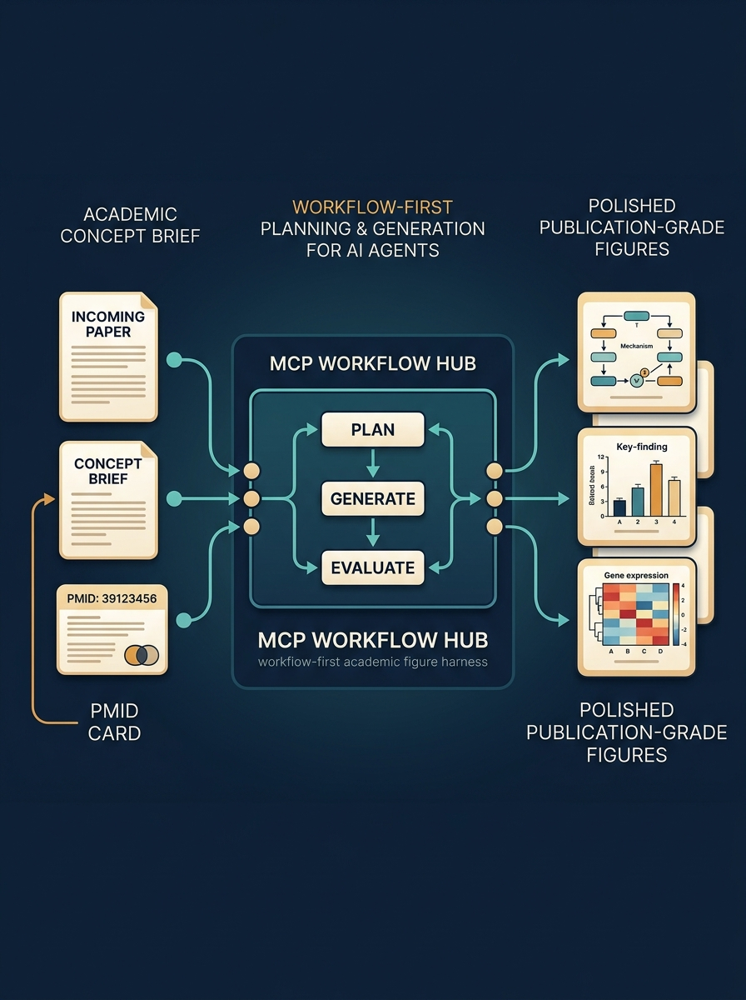
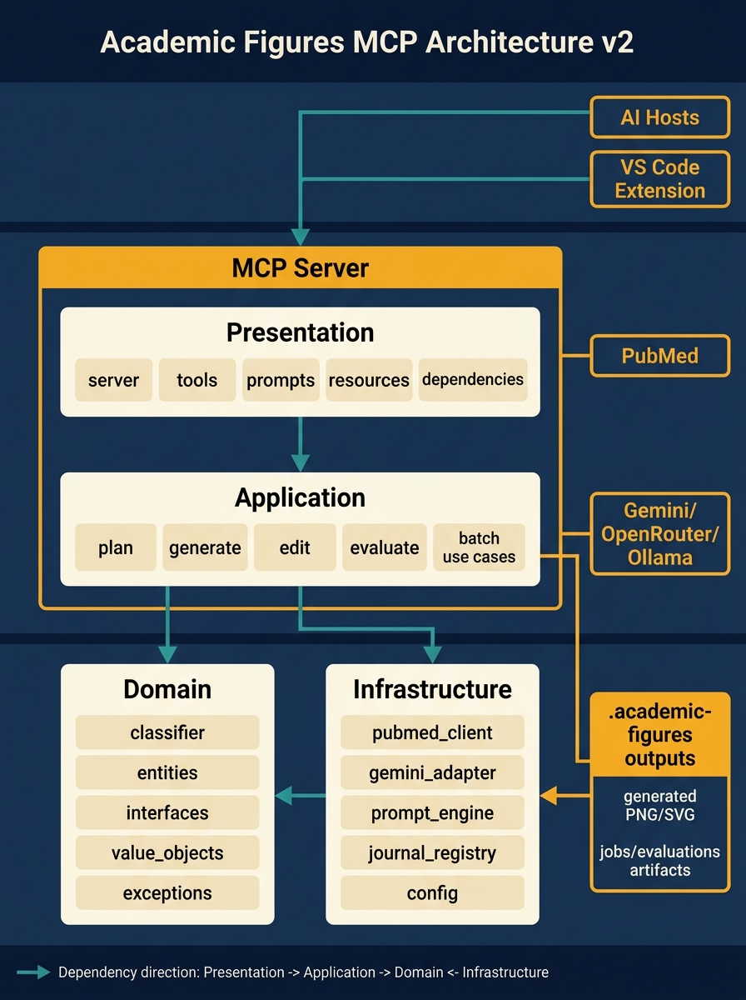
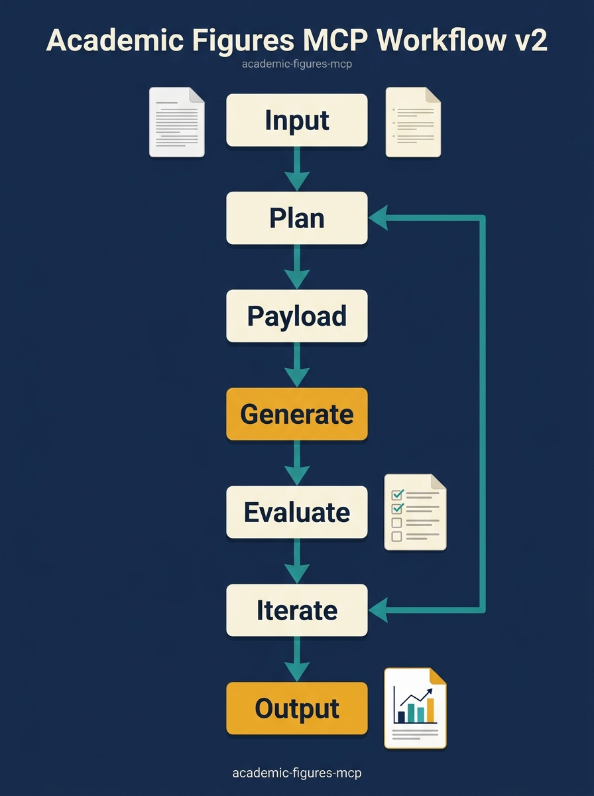

# 🎨 Academic Figures MCP

**A multi-step academic figure agent harness for AI agents and non-engineers.**

Academic Figures MCP is a workflow harness for multi-step academic reasoning and figure production. PMID ingestion is one structured entry point, but the real product value is helping an agent move through academic planning, concept decomposition, figure-type selection, prompt orchestration, image generation, evaluation, and iteration until it reaches a publication-grade result. MCP exposure and VSX packaging make that workflow usable without requiring engineering-heavy setup.

## Why This Exists

Generating academic figures normally requires:

1. Manual prompt engineering ✍️
2. Journal standard research 📚
3. Color code lookup 🎨
4. Quality self-review ✅
5. Retry loops 🔄

This harness automates those steps and exposes them through MCP so agents can work through the academic reasoning process in an orderly way. The image API is supporting infrastructure; the product value is the structured workflow that helps an agent plan and produce academic-grade figures.

It now includes a YAML-backed journal registry so the MCP layer can inject figure requirements for targets such as Nature, Science, JAMA, NEJM, and Lancet without forcing the agent to memorize house rules.

## MCP Surface

This server targets the modern MCP Python SDK line and is intended to expose:

- 5 execution tools for planning, generic generation, editing, evaluation, and batch workflows
- resources for discovery of presets, templates, and Gemini image defaults
- reusable prompts for figure planning and style transformation

## Harness Flow

The system is designed as a multi-step academic workflow:

1. Start from a structured source such as a PMID, an academic objective, or a figure revision request.
2. Reason about the scientific concept, communication goal, and target figure type.
3. Organize the request into a structured plan using academic constraints and journal conventions.
4. Generate the figure through the provider layer.
5. Evaluate the result against academic-quality criteria.
6. Iterate until the output is publication-grade.

## 5 MCP Tools

| Tool | Input | Output |
| ---- | ----- | ------ |
| `plan_figure` | `pmid`, `figure_type?`, `style_preset?` | Structured plan with route, constraints, and next-step arguments |
| `generate_figure` | `planned_payload` or compatibility `pmid` bridge | Generated asset from a generic render request |
| `edit_figure` | `image_path`, `feedback` | Refined image via Gemini edit API |
| `evaluate_figure` | `image_path`, `figure_type?` | 8-domain scorecard with suggestions |
| `batch_generate` | `pmids: list`, `figure_type?` | Batch generation results |

`generate_figure` is now internally plan-first. If you pass a PMID directly, the server first builds a planning payload and then renders from that payload. The canonical contract remains `plan_figure` followed by `generate_figure(planned_payload=...)`.

## Product Positioning

The core differentiator is not simply "connected to an image model API".

- It is a complete academic-figure agent harness.
- It helps agents reason through academic concepts before they generate.
- It is exposed through MCP so multiple AI hosts can drive the same workflow.
- It is packaged as a VSX experience so non-engineers can adopt it quickly.
- Provider integrations such as Google Gemini or OpenRouter are replaceable infrastructure behind that harness.

## Competitive Landscape

The current GitHub- and web-based benchmark is documented in [docs/competitive-landscape.md](docs/competitive-landscape.md).

That document separates:

- direct competitors
- adjacent reusable wheels
- strengths worth absorbing
- core product differences we should not copy away

## Project Documents

Key repo-level documents:

- [ROADMAP.md](ROADMAP.md) for planned capabilities and sequencing
- [CHANGELOG.md](CHANGELOG.md) for notable project changes
- [docs/competitive-landscape.md](docs/competitive-landscape.md) for market and positioning context

## Generated Visuals & QA

The following three visuals were generated by this repository's own MCP workflow and then reviewed through the built-in `evaluate_figure` path.

This section is intentionally self-hosting: each image below was generated from the payload files under [.academic-figures/jobs](.academic-figures/jobs), and each QA report was produced by this same repository through `scripts/start_afm_local.py run evaluate` against the generated output image. These are not manually drawn marketing assets or hand-written review notes.

### Introduction Visual



QA summary:

- Score: `5.0/5.0`
- Strengths: clear story from academic input to MCP workflow hub to publication-grade outputs
- Critical issues: none identified
- Full report: [repo-intro-hero-eval.json](.academic-figures/evaluations/repo-intro-hero-eval.json)

### Architecture Visual



QA summary:

- Score: `5/5`
- Strengths: explicit DDD layering, clear `Presentation -> Application -> Domain <- Infrastructure` direction, and repo-specific integration edges
- Critical issues: none identified
- Full report: [repo-architecture-v2-eval.json](.academic-figures/evaluations/repo-architecture-v2-eval.json)

### Workflow Visual



QA summary:

- Score: `4.6/5`
- Strengths: one clean main path, strong readability, high visual polish, and the duplicate `PAYLOAD` error is removed in v2
- Critical issues: no formal citation or source attribution is shown inside the figure
- Full report: [repo-workflow-flowchart-eval.json](.academic-figures/evaluations/repo-workflow-flowchart-eval.json)

## Quick Install

```bash
git clone https://github.com/u9401066/academic-figures-mcp.git
cd academic-figures-mcp
uv sync
# then copy env.example to env and fill one provider key,
# or provide GOOGLE_API_KEY / OPENROUTER_API_KEY through your shell or MCP host config
```

## Local Env File

For local runs and smoke tests, copy [env.example](env.example) to `env` and fill exactly one provider section.

Supported formats:

- `KEY=value`
- `export KEY=value`
- `set KEY=value`

Provider examples:

- `AFM_IMAGE_PROVIDER=google` with `GOOGLE_API_KEY`
- `AFM_IMAGE_PROVIDER=openrouter` with `OPENROUTER_API_KEY`
- `AFM_IMAGE_PROVIDER=ollama` with `OLLAMA_BASE_URL` and `OLLAMA_MODEL`

## Smoke Test

You can run a sanitized end-to-end smoke test with:

```bash
uv run python scripts/env_smoke_test.py env
```

The script only prints variable presence and a compact result summary. It never prints API key values.

## Usage

### VS Code Copilot

Add to your Copilot MCP settings (`.vscode/mcp.json`):

```json
{
  "servers": {
    "academicFigures": {
      "type": "stdio",
      "envFile": "${workspaceFolder}/env",
      "command": "uv",
      "args": [
        "run",
        "--project",
        "${workspaceFolder}",
        "python",
        "-m",
        "src.presentation.server"
      ]
    }
  }
}
```

This launch shape is shell-neutral and works across Windows, macOS, and Linux as long as `uv` is installed. It also keeps the project root explicit through `--project ${workspaceFolder}` while loading secrets from the repo-root `env` file via `envFile`.

### Manual Local Startup

Cross-platform launcher:

```bash
uv run python scripts/start_afm_local.py server
```

Run the first figure directly through `afm-run`:

```bash
uv run python scripts/start_afm_local.py run generate --pmid 41657234 --language zh-TW --output-size 1024x1536
```

This direct `--pmid` path is a compatibility bridge. It now performs the planning step internally before rendering.

Inject a journal profile explicitly when you want the planner and renderer to enforce a house style:

```bash
uv run python scripts/start_afm_local.py run plan --pmid 41657234 --target-journal Nature
uv run python scripts/start_afm_local.py run generate --pmid 41657234 --target-journal JAMA
```

Run generic asset generation through the same public tool using a JSON payload file:

```bash
uv run python scripts/start_afm_local.py run generate --payload-file .academic-figures/jobs/icon-request.json --output-dir .academic-figures/outputs
```

The same wrapper also supports direct planning and evaluation:

```bash
uv run python scripts/start_afm_local.py run plan --pmid 41657234
uv run python scripts/start_afm_local.py run evaluate --image-path .academic-figures/outputs/your-file.png
```

Windows PowerShell shortcut:

```powershell
powershell -NoProfile -ExecutionPolicy Bypass -File scripts/start_afm_local.ps1 server
```

Then just ask:

- "Generate a flowchart for PMID 41657234"
- "Help me plan the right academic figure structure for PMID 41657234 before generating it"
- "幫我做 PMID 41657234 的 consensus flowchart"
- "What figure type should I use for PMID 34567890?"
- "Help me turn this academic concept into a publication-grade figure plan"

The VS Code extension can now run plan, generate, transform, and evaluate commands directly through `afm-run` instead of copying prompts into chat.

### Claude Code / Cursor / Any MCP Host

Any MCP-compatible agent can use these tools directly.

For local development with the newer MCP SDK transport options, the server defaults to `stdio`, and can also be started with `MCP_TRANSPORT=streamable-http` for HTTP-based inspection workflows.

## Architecture

```text
┌──────────────────────┐
│  Your AI Agent       │     VS Code Copilot, Claude Code,
│  (Copilot, Claude,   │     OpenClaw, Hermes, etc.
│   any MCP host)      │
└──────────┬───────────┘
           │  MCP stdio / streamable-http
           ▼
┌──────────────────────────┐
│  Academic Figures MCP    │
│  ┌────────────────────┐  │
│  │ plan_figure        │  │
│  │ generate_figure    │  │
│  │ edit_figure        │  │  5 Tools
│  │ evaluate_figure    │  │
│  │ batch_generate     │  │
│  └────────┬───────────┘  │
│           │               │
│  ┌────────▼─────────────┐ │
│  │ Core Orchestrator    │ │
│  │                      │ │
│  │ 1. fetch_paper()     │ │  → PubMed E-utilities
│  │ 2. classify_type()   │ │  → Keyword + structured planning heuristics
│  │ 3. build_payload()   │ │  → reusable render request / prompt pack
│  │ 4. generate_image()  │ │  → single public renderer (Google / OpenRouter / Ollama SVG)
│  │ 5. evaluate()        │ │  → 8-domain vision scoring or local critique
│  │ 6. iterate()         │ │  → harness-guided revision loop
│  └──────────────────────┘ │
└──────────────────────────┘
```

## Figure Types & Auto-Classification

The MCP auto-classifies papers into optimal figure types:

| Type | Best For | Example Papers |
| ---- | -------- | -------------- |
| **Flowchart** | Consensus, guidelines | "SSC 2026 Sepsis Guidelines" |
| **Mechanism** | Drug mechanisms, pathways | "Sugammadex encapsulation mechanism" |
| **Comparison** | RCTs, meta-analyses | "Crystalloid vs Colloid fluid resuscitation" |
| **Infographic** | Reviews, overviews | "Perioperative fasting consensus" |
| **Timeline** | Historical, longitudinal | "Evolution of general anesthesia" |
| **Anatomical** | Surgical techniques, blocks | "Regional anesthesia approaches" |
| **Data Visual** | PK/PD, dose-response | "Propofol PK modeling" |

## Knowledge Base (Included)

This repo ships with 9 curated reference assets:

| File | Content |
| ---- | ------- |
| `prompt-templates.md` | 7-block prompt templates for 9 figure types |
| `anatomy-color-standards.md` | Medical illustration color coding reference |
| `journal-figure-standards.md` | Nature/Lancet formatting requirements |
| `journal-profiles.yaml` | Machine-readable journal registry for automatic prompt injection |
| `gemini-tips.md` | Gemini 3.1 Flash prompt engineering best practices |
| `model-benchmark.md` | NB2 vs GPT Image 1.5 comparison data |
| `code-rendering.md` | matplotlib/Python figure generation reference |
| `scientific-figures-guide.md` | Scientific figure design principles |
| `ai-medical-illustration-evaluation.md` | 8-domain evaluation rubric |

## Planned Rendering Ecosystem

This project is no longer framed as a single-route Gemini prompt server. The current design direction is a multi-route figure system:

- `Matplotlib` + `SciencePlots` for deterministic, publication-style charts
- `D2` + `Mermaid` for structured diagrams and editable text-first figure specs
- `FigureFirst` + `CairoSVG` for precise multi-panel assembly and export
- `Excalidraw` or `tldraw` as future interactive vector-editing layers inside the VS Code extension
- `Kroki` as an optional self-hosted render gateway for compatibility with multiple DSL engines

## Development

```bash
uv sync
uv run python -m src.presentation.server
```

The planned Gemini image integration follows the current Google Gen AI SDK pattern:

```python
from google import genai
from google.genai import types
```

## License

Apache License 2.0. See LICENSE.

## Composite Engine (Multi-Panel Layout)

The `composite` module solves Gemini's weakness with multi-panel figures.
Instead of generating a single image with all panels (which often fails on
spatial layout, numbering, and mixed styles), it:

1. **Generates each panel independently** with focused prompts
2. **Composites them using Pillow** with precise pixel-level layout
3. **Programmatic text overlay** — 100% accurate labels, no misspellings

### Composite Usage

```python
from src.composite import CompositeFigure, PanelSpec
from src.server import generate_figure

# Step 1: Generate panels separately
left = generate_figure(pmid="41657234", figure_type="anatomy")
right = generate_figure(pmid="41657234", figure_type="ultrasound")

# Step 2: Composite
comp = CompositeFigure()
comp.add_panel(
    PanelSpec(prompt="...", label="A", panel_type="anatomy"),
    left["image_path"]
)
comp.add_panel(
    PanelSpec(prompt="...", label="B", panel_type="ultrasound"),
    right["image_path"]
)
comp.set_title("Interscalene Brachial Plexus Block")
comp.set_citation("PMID 41657234 · Regional Anesthesia")
comp.compose("interscalene_block.pdf")
```

### MCP Tool: `composite_figure`

```text
composite_figure(
    panels=[["left.png", "anatomy"], ["right.png", "ultrasound"]],
    labels=["A", "B"],
    title="..."
)
```

### Layout Specs

| Property | Value |
| -------- | ----- |
| Canvas | 2400 × 1600 px (8" × 5.33" @ 300 DPI) |
| Format | Double column (~183mm width, Nature standard) |
| Labels | A/B/C with pill-shaped background |
| Footer | Caption + PMIDs + citation |
| Divider | Vertical line between panels |
