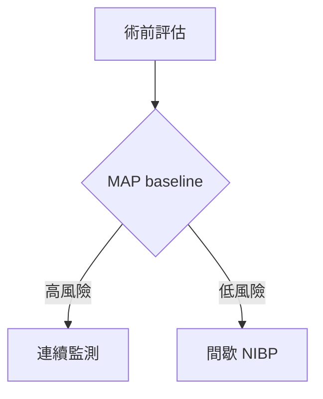

# Code-Based Rendering Guide

When direct image generation produces garbled text or imprecise layouts, 
generate code and render locally for publication-quality output.

## Route 1: Python (matplotlib/seaborn)
Best for: statistical plots, bar charts, heatmaps, forest plots

```python
# Example: Clinical trial comparison bar chart
import matplotlib.pyplot as plt
import matplotlib
matplotlib.rcParams['font.family'] = ['Noto Sans CJK TC', 'DejaVu Sans']

fig, ax = plt.subplots(figsize=(10, 6))
# ... plot code ...
plt.savefig('output.png', dpi=300, bbox_inches='tight')
```

Key: Set CJK font family for correct Chinese rendering.

### Nature-compliant rcParams 模板（2026-04-09）

```python
import matplotlib.pyplot as plt
import matplotlib
import scienceplots  # ⚠️ 2.0+ 必須先 import

plt.style.use(['science', 'nature'])
matplotlib.rcParams.update({
    'font.family': 'Arial',        # Nature 指定字體
    'font.size': 7,                # 5–7pt 範圍
    'pdf.fonttype': 42,            # 避免 outline text
    'figure.dpi': 300,
    'savefig.dpi': 300,
    'axes.linewidth': 0.5,         # Nature 細線風格
    'lines.linewidth': 0.5,        # 最小 0.25pt
})

# Figure size: single column = 3.5 inches wide
fig, ax = plt.subplots(figsize=(3.5, 2.5))  # single column
# 或 double column:
# fig, ax = plt.subplots(figsize=(7.2, 4.0))
```

### Key Best Practices

1. **Separate data from styling** — Ask AI to put all configurable parameters at the top as variables
2. **Use SciencePlots for instant journal-ready styling** — see SciencePlots Reference below
3. **Generate complex figures panel-by-panel**, not all at once
4. **Always verify numerical accuracy** — bar heights, axis scales, legend labels

### Known Limitations
- Numerical hallucination — bar heights may not match scale. Always verify data accuracy.
- Label overlap — use `plt.tight_layout()` or manual `bbox_to_anchor`.
- Style inconsistency — specify color palette explicitly in every prompt.
- Complex multi-panel layouts often break — generate panels separately.

---

## Route 2: SVG (direct XML)
Best for: flowcharts, architecture diagrams, precise layouts

Generate SVG XML directly, then convert:
```bash
# Convert SVG to PNG
cairosvg input.svg -o output.png -d 300
# or with Inkscape
inkscape input.svg --export-type=png --export-dpi=300
```

---

## Route 3: Mermaid
Best for: quick flowcharts, sequence diagrams, state diagrams



**Medical color convention:**
```
style A fill:#E3F2FD,stroke:#1565C0    %% Input: light blue
style C fill:#FFEBEE,stroke:#C62828    %% High risk: light red
style D fill:#E8F5E9,stroke:#2E7D32    %% Low risk: light green
style B fill:#FFF8E1,stroke:#F9A825    %% Decision: amber
```

### 進階技巧（2026-04-09 更新）

**1. classDef 批量樣式（適用於大量同類型節點）**
```mermaid
classDef procedure fill:#E3F2FD,stroke:#1565C0,stroke-width:2px;
classDef risk fill:#FFEBEE,stroke:#C62828,stroke-width:2px;
classDef decision fill:#FFF8E1,stroke:#F9A825,stroke-width:2px;

A:::procedure --> B:::decision
B -->|高| C:::risk
B -->|低| D:::procedure
```

**2. subgraph 分組（適用於臨床路徑分階段）**
```
subgraph Phase1 [術前期準備]
    direction TB
    A1 --> A2
end
subgraph Phase2 [術中監測]
    B1 --> B2
end
Phase1 --> Phase2
```

**3. 主題配置（frontmatter）**
```
---
config:
  theme: base
  themeVariables:
    primaryColor: '#E3F2FD'
    primaryBorderColor: '#1565C0'
    primaryTextColor: '#0D47A1'
    lineColor: '#1565C0'
    fontFamily: 'Arial, Helvetica, sans-serif'
    fontSize: '16px'
---
```

**⚠️ Mermaid 限制：**
- 節點 label 不能有括號、引號、方括號（會導致語法錯誤）
- 最大約 12 個節點，超出會布局混亂
- GitHub 原生渲染（Issues, PRs, Wiki, Markdown）
- 自訂主題僅在自架環境生效；GitHub 只支援 5 種內建主題（default/neutral/dark/forest/base）
- 不支援自訂 CSS；theming engine 只認 hex 色碼不認色名
- 只有 `base` 主題可自訂 themeVariables

### Render

```bash
npx @mermaid-js/mermaid-cli mmdc -i input.mmd -o output.png -w 1200
```

Python 渲染（Jupyter Notebook）：
```python
from IPython.display import Image, display
mermaid_code = """graph TD\n    A[A]-->B[B]"""
import urllib.parse, base64
encoded = base64.b64encode(mermaid_code.encode()).decode()
url = f"https://mermaid.ink/img/{encoded}"
display(Image(url=url))
```

---

## Route 4: TikZ (LaTeX)
Best for: publication-ready figures matching journal style

## Route 5: PlantUML
Best for: UML-style diagrams, activity diagrams

## Which Route to Choose?

| Need | Route | Why |
|------|-------|-----|
| Statistical plot | Python | matplotlib is gold standard |
| Quick flowchart | Mermaid | Fast, readable syntax |
| Precise layout with CJK | SVG | Full text control |
| Journal submission | TikZ | Matches LaTeX papers |
| System architecture | PlantUML/Mermaid | Standard UML notation |
| Fishbone / PPTX | **lib/** (see below) | Reusable modules, no repeated code |

## Font Setup for CJK
```bash
# NotoSansTC already downloaded to ~/clawd2/fonts/NotoSansTC-Regular.otf
# chart_base.py handles font loading automatically — no manual setup needed
```

---

## Reusable lib/ Modules (Preferred for Python route)

Location: `skills/medical-illustration/lib/`

### Quick Start

```python
import sys
sys.path.insert(0, "/path/to/skills/medical-illustration")

from lib.fishbone import render
from lib.pptx_builder import build

data = {
    "title": "問題分析",
    "subtitle": "Fishbone Diagram",
    "effect": "核心\n問題",
    "footer": "製圖：繪晴 AI 2026",
    "categories": {
        "人 (Man)": {
            "color": "#E53935",   # 可省略，預設自動配色
            "causes": ["原因1", "原因2", "原因3", "原因4", "原因5"]
        },
        "法 (Method)": {
            "causes": ["原因1", "原因2", "原因3", "原因4", "原因5"]
        },
        # ... 最多6個類別
    }
}

png_path  = render(data, filename="output.png", dpi=200)
pptx_path = build(png_path, data, filename="output.pptx")
```

### Modules

| 模組 | 功能 | 主要函式 |
|---|---|---|
| `chart_base.py` | 字型、色彩、路徑共用設定 | `setup_matplotlib()`, `output_path()` |
| `fishbone.py` | 魚骨圖 PNG 生成 | `render(data, filename, dpi)` |
| `pptx_builder.py` | PPTX 多張投影片 | `build(png_path, data, filename)` |

### Example
完整範例：`lib/example_OR_sustainability.py`

---

## SciencePlots Reference

### Journal styles available:
- `['science']` — generic Science format
- `['science', 'ieee']` — IEEE transactions
- `['science', 'nature']` — Nature journals（自動設 sans-serif + Nature 風格）
- `['science', 'no-latex']` — No LaTeX rendering (faster)
- `['science', 'grid']` — With gridlines

### Color cycles:
- `bright` — colorblind-safe (Wong palette)
- `high-vis` — high contrast
- `discrete-rainbow-<n>` — Paul Tol sets, n=1-23

### CJK support:
`['science', 'no-latex', 'cjk-tc-font']` for Traditional Chinese

Installation: `pip install SciencePlots`
GitHub: https://github.com/garrettj403/SciencePlots

*Last updated: 2026-04-09*
